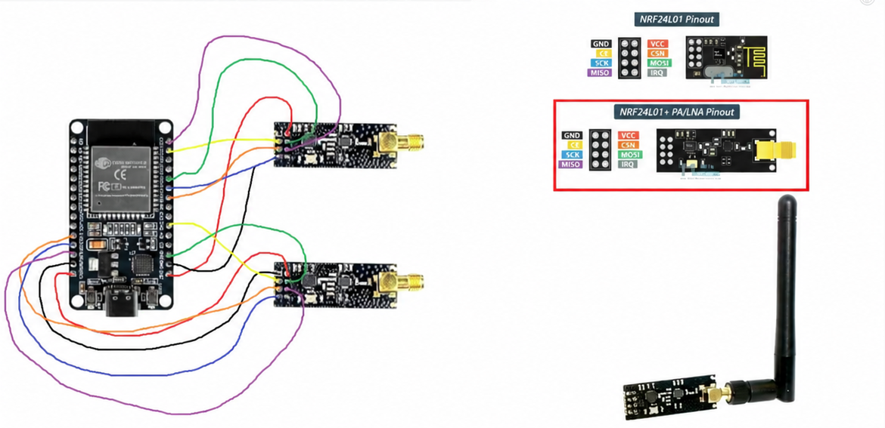
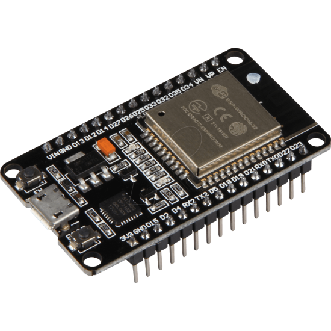
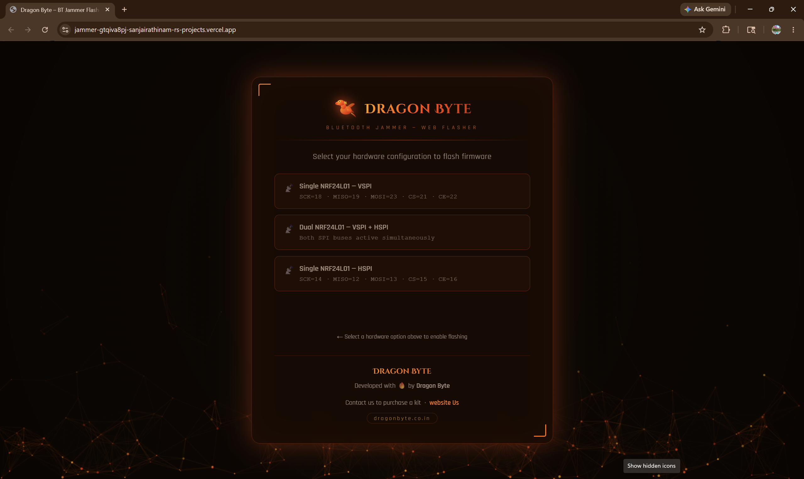

<div align="center">

# 🐉 DRAGON BYTE
### BLUETOOTH JAMMER — WEB FLASHER

[](https://www.espressif.com/)
[](https://dragonbyte.co.in)
[](https://jammer-gtqiva8pj-sanjaijrathinam-rs-projects.vercel.app)
[](LICENSE)

> Flash your ESP32 + NRF24L01+ Bluetooth jammer firmware directly from the browser — no IDE required.

🔥 **[Live Web Flasher →](https://jammer-gtqiva8pj-sanjaijrathinam-rs-projects.vercel.app)** &nbsp;|&nbsp; 🌐 **[dragonbyte.co.in →](https://dragonbyte.co.in)**

</div>

---

## ⚠️ Legal Disclaimer

> **This project is intended strictly for educational and authorized security research purposes only.**
> Jamming or interfering with wireless communications (including Bluetooth) is **illegal** in most countries
> without explicit authorization from the relevant regulatory authority (e.g., FCC in the USA, TRAI in India).
> **Dragon Byte and contributors are not responsible for any misuse of this tool.**
> Use only in a controlled lab environment on hardware/devices you own and have permission to test.

---

## 📸 Hardware Photos

| ESP32 + Dual NRF24L01+ Wiring | NRF24L01+ PA/LNA Module |
|-------------------------------|------------------------|
|  |  |

| Dragon Byte Web Flasher | Complete Assembly |
|------------------------|------------------|
|  |  |

> 📁 Add your own photos inside the `assets/` folder with the filenames above.

---

## 📋 Table of Contents

- [Overview](#overview)
- [Components & Buy Links](#-components--buy-links)
- [Wiring Guide](#-wiring-guide)
- [Web Flasher](#-web-flasher)
- [Hardware Configurations](#️-hardware-configurations)
- [Getting Started](#-getting-started)
- [Troubleshooting](#-troubleshooting)
- [Contributing](#-contributing)
- [License](#-license)

---

## Overview

**Dragon Byte BT Jammer** uses an **ESP32** microcontroller paired with one or two **NRF24L01+ PA/LNA** modules
to transmit noise across the 2.4 GHz band — the frequency range used by Bluetooth, Wi-Fi, and Zigbee devices.

The project ships with a **browser-based web flasher** built on the Web Serial API, allowing you to flash
firmware directly to your ESP32 without installing any software.

---

## 🛒 Components & Buy Links

| Component | Qty | Buy Link |
|-----------|-----|----------|
| ESP32 Dev Board (38-pin) | × 1 | [Robu.in →](https://robu.in/product/esp32-development-board-wifi-bluetooth-ultra-low-power-consumption-dual-cores/) · [Amazon.in →](https://www.amazon.in/s?k=esp32+38+pin+development+board) |
| NRF24L01+ PA/LNA Module | × 1–2 | [Robu.in →](https://robu.in/product/nrf24l01-pa-lna-wireless-transceiver-module/) · [Amazon.in →](https://www.amazon.in/s?k=nrf24l01+pa+lna+module) |
| Jumper Wires M-F 20cm | × 20 | [Robu.in →](https://robu.in/product/20cm-male-to-female-jumper-wire-40pcs/) · [Amazon.in →](https://www.amazon.in/s?k=jumper+wires+male+female) |
| 100µF Electrolytic Capacitor | × 1 | [Robu.in →](https://robu.in/product/100uf-25v-electrolytic-capacitor-pack-of-25/) · [Amazon.in →](https://www.amazon.in/s?k=100uf+capacitor) |
| USB-C / Micro-USB Data Cable | × 1 | [Amazon.in →](https://www.amazon.in/s?k=usb+c+data+cable) |
| 🎁 Complete Dragon Byte Kit | × 1 | [dragonbyte.co.in →](https://dragonbyte.co.in) |

---

## 🔧 Wiring Guide

### NRF24L01+ PA/LNA Pinout

```
┌─────────────────────┐
│  [ GND ] [ VCC ]    │
│  [  CE ] [ CSN ]    │
│  [ SCK ] [MOSI ]    │
│  [MISO ] [ IRQ ]    │  ◄── External Antenna
└─────────────────────┘
```

---

### Single Module — VSPI (Default)

```
ESP32           NRF24L01+ PA/LNA
─────           ────────────────
GND    ●────●  GND       (Black  ⬛)
3.3V   ●────●  VCC       (Red    🟥)  + 100µF cap
GPIO22 ●────●  CE        (Yellow 🟨)
GPIO21 ●────●  CSN       (Orange 🟧)
GPIO18 ●────●  SCK       (Green  🟩)
GPIO23 ●────●  MOSI      (Blue   🟦)
GPIO19 ●────●  MISO      (Purple 🟪)
```

| NRF24L01+ | ESP32 GPIO | Wire Color |
|-----------|------------|------------|
| GND | GND | ⬛ Black |
| VCC | 3.3V | 🟥 Red |
| CE | GPIO 22 | 🟨 Yellow |
| CSN | GPIO 21 | 🟧 Orange |
| SCK | GPIO 18 | 🟩 Green |
| MOSI | GPIO 23 | 🟦 Blue |
| MISO | GPIO 19 | 🟪 Purple |

---

### Single Module — HSPI

| NRF24L01+ | ESP32 GPIO | Wire Color |
|-----------|------------|------------|
| GND | GND | ⬛ Black |
| VCC | 3.3V | 🟥 Red |
| CE | GPIO 16 | 🟨 Yellow |
| CSN | GPIO 15 | 🟧 Orange |
| SCK | GPIO 14 | 🟩 Green |
| MOSI | GPIO 13 | 🟦 Blue |
| MISO | GPIO 12 | 🟪 Purple |

---

### Dual Module — VSPI + HSPI

```
ESP32
├── VSPI ──► Module #1  (SCK=18, MISO=19, MOSI=23, CS=21, CE=22)
└── HSPI ──► Module #2  (SCK=14, MISO=12, MOSI=13, CS=15, CE=16)
```

Both SPI buses run simultaneously for wider 2.4 GHz band coverage.

> ⚡ **Power Tip:** Add a **100µF capacitor** between VCC and GND on each NRF module to stabilize power and prevent resets.

---

## 🌐 Web Flasher

The web flasher uses the **Web Serial API** — works in **Chrome / Edge v89+** only.

**Live URL:** [https://jammer-gtqiva8pj-sanjaijrathinam-rs-projects.vercel.app](https://jammer-gtqiva8pj-sanjaijrathinam-rs-projects.vercel.app)

### Flash Steps

1. Wire up your ESP32 + NRF24L01+ per the wiring guide above
2. Plug the ESP32 into your computer via USB **data** cable
3. Open the [Web Flasher](https://jammer-gtqiva8pj-sanjaijrathinam-rs-projects.vercel.app) in Chrome or Edge
4. Select your hardware configuration
5. Click **Flash Firmware** → choose the correct COM port when prompted
6. Wait ~30 seconds for the flash to complete ✅

> ⚠️ **Firefox is not supported.** Use Chrome or Edge only.

---

## ⚙️ Hardware Configurations

Three firmware builds are available in the web flasher:

| Configuration | SPI Bus | Pin Mapping |
|---------------|---------|-------------|
| **Single NRF24L01 — VSPI** | VSPI | SCK=18, MISO=19, MOSI=23, CS=21, CE=22 |
| **Dual NRF24L01 — VSPI + HSPI** | Both | Both SPI buses active simultaneously |
| **Single NRF24L01 — HSPI** | HSPI | SCK=14, MISO=12, MOSI=13, CS=15, CE=16 |

---

## 🚀 Getting Started

### 1. Install USB Drivers

| Chip | Download |
|------|----------|
| CP210x (most ESP32 boards) | [silabs.com/developers/usb-to-uart-bridge-vcp-drivers →](https://www.silabs.com/developers/usb-to-uart-bridge-vcp-drivers) |
| CH340 (clone boards) | [wch.cn/downloads/CH341SER_EXE.html →](https://www.wch.cn/downloads/CH341SER_EXE.html) |

### 2. Connect Hardware → Flash → Done

```bash
1. Wire hardware per guide above
2. Plug USB cable into ESP32
3. Open web flasher in Chrome/Edge
4. Select config → Flash → Pick COM port
5. Done ✅
```

---

## 🛠 Troubleshooting

| Issue | Fix |
|-------|-----|
| COM port not detected | Install [CP210x](https://www.silabs.com/developers/usb-to-uart-bridge-vcp-drivers) or [CH340](https://www.wch.cn/downloads/CH341SER_EXE.html) driver |
| Flash fails / times out | Hold **BOOT** button on ESP32 when flashing starts |
| Module not responding | Add 100µF cap between VCC and GND of NRF module |
| Dual mode — one module dead | Verify HSPI wiring; CSN pins must be different GPIOs |
| "Not Supported" in browser | Use Chrome or Edge v89+; Firefox not supported |
| Weak/no signal | Use PA/LNA variant with external SMA antenna |

---

## 🤝 Contributing

Pull requests are welcome. For major changes, please open an issue first.

```bash
# Fork → Clone → Branch → Commit → Push → PR
git checkout -b feature/my-feature
git commit -m "Add my feature"
git push origin feature/my-feature
```

---

## 📄 License

MIT License — see [LICENSE](LICENSE) for details.

---

<div align="center">

Developed with 🔥 by **[Dragon Byte](https://dragonbyte.co.in)**

📧 Contact us to purchase a kit → [dragonbyte.co.in](https://dragonbyte.co.in)

`dragonbyte.co.in`

</div>
